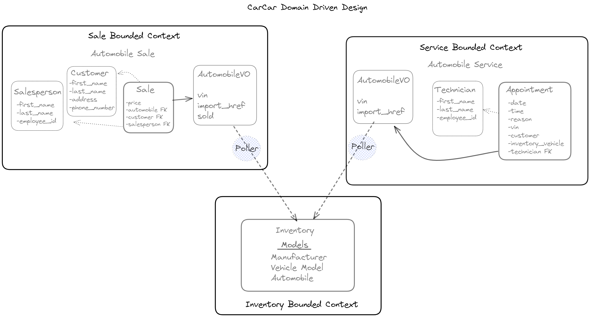

# CarCar

Team:
* Ikran Haji- Automobile sales
* Jasmine Bagha - Automobile Services

## Design
This microservices project was designed using Django for the backend features and React for the frontend features. The Django back end was created using RESTful APIs. The React front end used Bootstrap for styling the pages with headers, columns, and navigation bars. A Domain Driven Design was also used to create applications based on need and functionality.

## Service microservice
The servicers microservice had three models:
1. The AutomobileVO model-this model was created to allow for polling of data from the inventory application. The vin number was one of the main peices of data that was polled to allow for updated information to be passed on to the services application.
2. Technician model-this model was created to allow for the creation, deletion, and list view of technicians
3. Appointment model- this model was created to allow for the creation, deletion, and list view of appointments. This model also allowed for each appointment to have a status of created, finished or cancelled. This albility allowed for the frontend user to create appointments, see a list of all appointments and also mark is an appointment was finished or cancelled. The AutomobileVO was also integrated to deterimine if a specific customer was a VIP depending on their vehicle's licence plate number matching the intentory of car licence plate numbers.
Examples of data for each endpoint:
1. First create a manufacturer-
{
  "name": "Toyota"
}
2. Then create a model (match the manufacturer_id to a manufacturer you created)-
{
  "name": "Corolla",
  "picture_url": "https://i.imgur.com/NuBuXm5b.jpg",
  "manufacturer_id": 1
}
3. Then create an automobile (match the model_id to a model you created. The vin needs to be unique)-
{
  "color": "green",
  "year": 2012,
  "vin": "JH4DC4401465",
  "model_id": 1
}
4. Then create a technician-
{
  "first_name": "Lucky",
  "last_name": "T",
  "employee_id": "123"
}
5. Then create an appointment (need to match a vin to an automobiel that was created, also need to use a created technician,
inventory vehicle is set to false by default so when a car appointment is made with a specific vin we can check if that vin exists in automobiles list and create VIP customers)
{
    "date": "2022-01-01",
    "time":"12:30",
    "reason": "Broken Window",
	"vin":"JH4DC4401465",
	"customer": "Suzy",
	"technician": "Lucky",
	"status":"Created",
	"inventory_vehicle": ""
}

6. Then create a salesperson-
{
  "first_name": "Henry",
  "last_name": "T",
  "employee_id": "258"
}
7. Then create a customer-
{
  "first_name": "Melonie",
  "last_name": "T",
  "address": "258 My House",
  "phone_number": "916-147-5360"
}

8. Create a sale (use a created automobile's vin number, use the id of the customer and the salesperson you created)-
{
  "price": 10000,
  "automobile": "JH4DC4440SS01465",
  "customer": 1,
  "salesperson": 1

}
